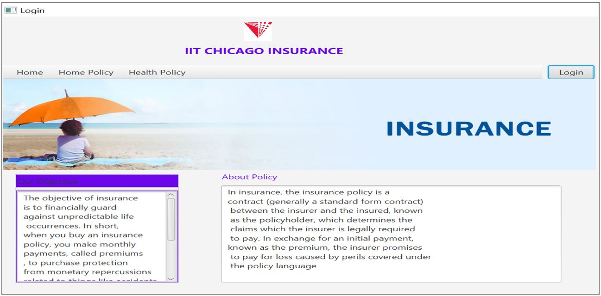
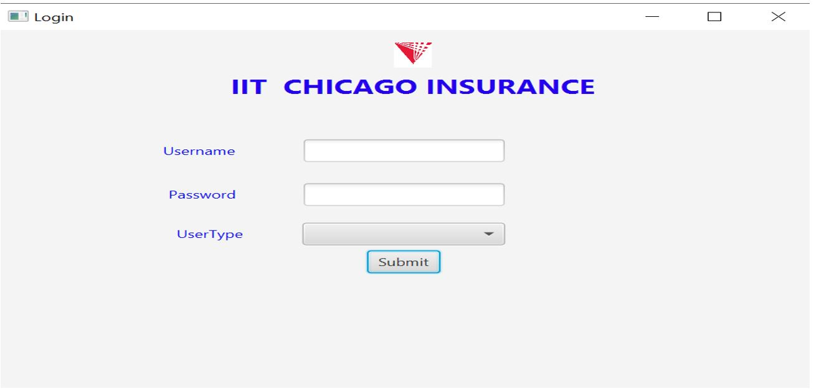

# Insurance Management System

## Technologies Used:

- Java
- JavaFX
- MySQL
 
## Project Overview

The Insurance Management System is a desktop application targeted at the different users like Branch Manager, Administrator, etc. to create different type of policies, generate quotes, provide specifications and other functionalities as a part of the Insurance Management. The main aim of this project is to build and showcase an application which would for the insurance company be able to atomize work procedure, provide details for current policies, schemes, policy specifications, terms and conditions on these policies as well as ability to register the policy by customers themselves. Along with the above functionalities it would also maintain information of branch managers who deals with customers.

### Modules of the Project

1.Administrator:

This module will focus on all the functionalities associated with the administrator. 
Admin can access the details the details of Policy, Branch and Branch Manager. This includes the authority to add, modify and delete policies, manage branch manager and branch details, etc. This module will be internal to the Insurance Management team and would not be exposed to the end users i.e. customer.

2.Branch manager:

This module will focus on the functionalities for the branch manager. This means developing and implementing functionality to manage customer’s policy operations like register, update and delete policies, functionalities to view and change status of the policy, etc. This would be the most complicated as well as the main module as it will be most exposed during the working of the system.

3.Customer:

This module will focus on the customer views and flows. In this for the customer we would develop functionality like being able to view his/her policy details, register for new policy, generate quotes, etc. This module would be most exposed to the end users of the system.

### Database Login and Passwords:

| UserType        | UserID           | Password  |
| ----------------|:----------------:| ---------:|
| Admin           | Admin            | AdminPwd1 |
| BranchManager   | BManager         | BMPwd1    |
| Customer        | Cust             | CustPwd2  |

 
### Application look and feel:
   
   
   

## To run the Script

In the project directory, under 'build' folder, you can run:

#### `php -S localhost:8888` to start a server > Go to the browser > Enter localhost:8888

